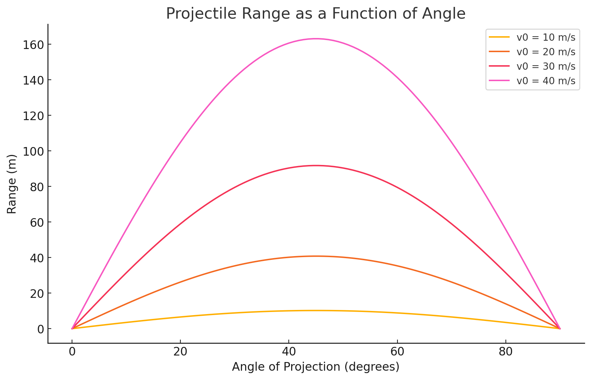

# Problem 1

Let's break it down step by step and implement a simulation to visualize how the range depends on the angle of projection.

---

## **Step 1: Theoretical Foundation** 

### **Derivation of Governing Equations**

A projectile is subject to **uniform acceleration** due to gravity and follows a parabolic trajectory. We assume:

- The projectile is launched with an initial velocity \( v_0 \) at an angle \( \theta \).
- The only force acting on it is gravity (ignoring air resistance).
- The motion is decomposed into **horizontal** and **vertical** components.

#### **Equations of Motion**
Using kinematic equations:

- **Horizontal Motion** (constant velocity, since no horizontal acceleration):

$$
  x = v_0 \cos(\theta) t
$$

- **Vertical Motion** (accelerated motion under gravity):
$$
  y = v_0 \sin(\theta) t - \frac{1}{2} g t^2
$$

where:
- \( g \) is the gravitational acceleration (\( 9.81 \, m/s^2 \)).
- \( t \) is the time elapsed.

#### **Time of Flight**
The time \( T \) when the projectile lands back on the ground (\( y = 0 \)) is found by solving:

$$
0 = v_0 \sin(\theta) T - \frac{1}{2} g T^2
$$

Factoring out \( T \):

$$
T = \frac{2 v_0 \sin(\theta)}{g}
$$

#### **Range of the Projectile**
The **range** \( R \) is the total horizontal distance traveled before hitting the ground:

$$
R = v_0 \cos(\theta) T
$$

Substituting \( T \):

$$
R = \frac{v_0^2 \sin(2\theta)}{g}
$$

**Observations:**
- The range is maximized when \( \sin(2\theta) \) is maximum, which occurs at \( 2\theta = 90^\circ \) (i.e., \( \theta = 45^\circ \)).
- The range is symmetric around \( 45^\circ \), meaning that an angle of \( 30^\circ \) and \( 60^\circ \) will give the same range.

---

## **Step 2: Analysis of the Range**
The range depends on:

1. **Initial Velocity** \(v_0\): 
- Higher \( v_0 \) increases the range quadratically.

2. **Angle of Projection** \(\theta\):
- The function \( \sin(2\theta) \) determines the shape of the range curve.

3. **Gravitational Acceleration** \(g\): 
- Stronger gravity reduces the range.

We will visualize how the range varies with \( \theta \) for different \( v_0 \) values.

---

## **Step 3: Computational Implementation** 🖥️

- Simulates projectile motion.
- Plots the range as a function of the angle \( \theta \).
- Explores different values of \( v_0 \).

 

Here is the plot showing the **range of a projectile as a function of the launch angle** for different initial velocities. 📊

### **Key Observations:**
1. The range follows a symmetric pattern with a **peak at 45°**, confirming our theoretical derivation.

2. The **higher the initial velocity \( v_0 \), the greater the range**, as expected since range depends on \( v_0^2 \).

3. The function \( R(\theta) = \frac{v_0^2 \sin(2\theta)}{g} \) ensures that **angles \( \theta \) and \( 90° - \theta \) result in the same range**, e.g., **30° and 60° produce identical distances**.

---

## **Step 4: Discussion on Model Limitations & Real-World Applications**
While the model is useful for **idealized projectile motion**, real-world scenarios involve:

- **Air Resistance** – Reduces range significantly, especially for high velocities.
- **Wind Effects** – Can increase or decrease range depending on direction.
- **Uneven Terrain** – Landing heights vary, affecting the actual range.
- **Spin Effects** – In sports, spin affects trajectory via the Magnus force (e.g., football or baseball).

### **Practical Applications**
- **Sports Science**: Optimizing angles for maximum shot distance (e.g., golf, football, basketball).
- **Military Applications**: Calculating artillery or missile trajectories.
- **Engineering & Physics**: Understanding knowledge in robotics, aerospace, and mechanical systems.
