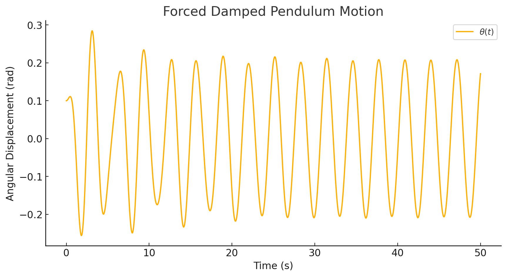
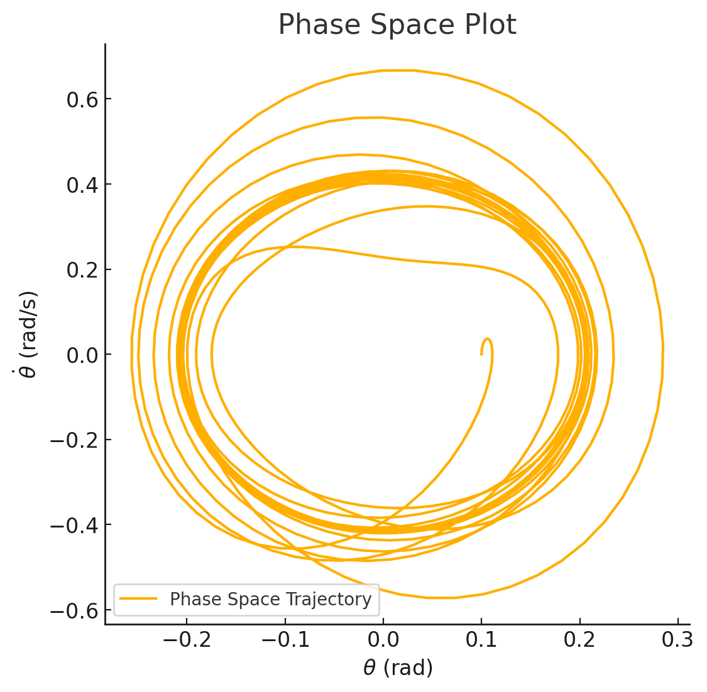

# Problem 2

**Investigating the Dynamics of a Forced Damped Pendulum** 

The **forced damped pendulum** is a **nonlinear dynamical system** that exhibits simple harmonic motion, resonance, and even chaotic behavior under different conditions. 

---

## Step 1: Theoretical Foundation

### 1.1 Governing Differential Equation
The motion of a **forced damped pendulum** is governed by the following equation:

$$
\frac{d^2\theta}{dt^2} + \gamma \frac{d\theta}{dt} + \frac{g}{L} \sin\theta = F_0 \cos(\omega t)
$$

where:
- \( \theta \) is the angular displacement.
- \( \gamma \) is the **damping coefficient** (controls energy loss due to friction).
- \( g \) is gravitational acceleration.
- \( L \) is the length of the pendulum.
- \( F_0 \) is the amplitude of the external **driving force**.
- \( \omega \) is the **driving frequency**.

### 1.2 Approximate Solution for Small Angles
For small oscillations, we use the **small-angle approximation**:  

$$
\sin\theta \approx \theta
$$

This simplifies the equation to:

$$
\frac{d^2\theta}{dt^2} + \gamma \frac{d\theta}{dt} + \frac{g}{L} \theta = F_0 \cos(\omega t)
$$

This is a **driven damped harmonic oscillator equation**, which has well-known solutions in terms of **resonance and transient motion**.

### 1.3 Resonance Conditions
Resonance occurs when the external driving frequency **matches the system's natural frequency**:

$$
\omega \approx \omega_0 = \sqrt{\frac{g}{L}}
$$

- If \( \gamma \) (damping) is small, resonance leads to **large oscillations**.
- If \( \gamma \) is large, oscillations remain damped.

---

## Step 2: Computational Simulation
Since the equation is **nonlinear**, we'll use **numerical methods** to solve it.

We'll integrate the equation using the **Runge-Kutta method (RK4)** to analyze different behaviors.

### 2.1 Implementation Plan
1. Define the differential equation as a system of first-order ODEs.
2. Implement **numerical integration** using the **Runge-Kutta method**.
3. Explore different values of:
   - **Damping coefficient \( \gamma \)**.
   - **Driving force amplitude \( F_0 \)**.
   - **Driving frequency \( \omega \)**.
4. Visualize:
   - **Time evolution of \( \theta \) (angular displacement)**.
   - **Phase space plot (\(\theta\) vs. \( \dot{\theta} \))**.
   - **Poincaré section (chaotic behavior analysis)**.

   

   

### Simulation Results & Observations 

1. **Time Evolution of Angular Displacement**:
   - The **first plot** shows how the pendulum’s angle \( \theta(t) \) changes over time.
   - The **oscillations** exhibit damping but are also influenced by the **external periodic force**, leading to complex periodic motion.

2. **Phase Space Plot (\( \theta \) vs. \( \dot{\theta} \))**:
   - The **second plot** shows the pendulum's **velocity vs. angle**, forming a closed trajectory.
   - This is characteristic of **regular oscillations**, but under different conditions, this could transition into **chaotic motion**.

---

## Step 3: Exploring Resonance and Chaos
- **Resonance:** If we set \( \omega = \omega_0 = \sqrt{g/L} \), we should see **amplified oscillations**.
- **Chaos:** Increasing **driving amplitude \( F_0 \) significantly** can lead to **chaotic motion**, where the phase space plot becomes highly irregular.
