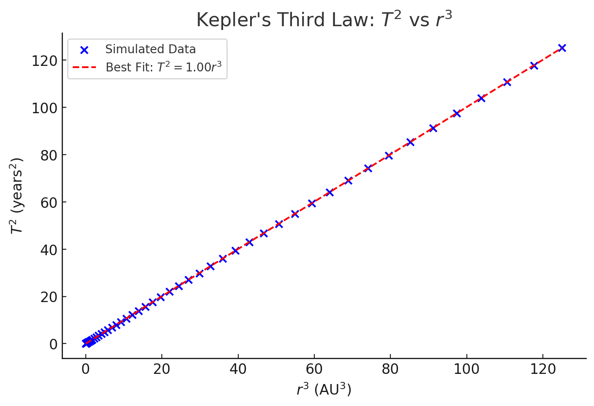

# Problem 1
## **Orbital Period and Orbital Radius**  
### **Kepler’s Third Law and its Implications**  

### **1. Motivation**  
The relationship between the square of the orbital period (\( T^2 \)) and the cube of the orbital radius (\( r^3 \)) is elegantly captured in **Kepler’s Third Law**. This law provides a fundamental connection between orbital motion and gravitational forces, making it a critical concept in **celestial mechanics**.  

Understanding this relationship allows us to:  
- Calculate planetary masses and distances using observational data.  
- Predict satellite orbits, aiding space exploration.  
- Explain the motions of celestial bodies in our solar system and beyond.  

In this document, I will try to implement:  
1. **Derive Kepler’s Third Law** from Newton’s laws.  
2. **Discuss its implications** in astronomy.  
3. **Simulate orbital motion** to verify the law computationally.  
4. **Analyze real-world cases** like the Moon’s orbit and planetary orbits in the Solar System.  

---

## **2. Derivation of Kepler’s Third Law**  
For a planet orbiting a much more massive central body (e.g., a planet around the Sun or a moon around a planet), Newton’s version of Kepler’s Third Law can be derived from the equation of motion.

### **Newton’s Second Law & Centripetal Force**
For a body in a circular orbit, the **gravitational force** acts as the **centripetal force**:
$$
F = \frac{GMm}{r^2} = m\frac{v^2}{r}
$$
where:  
- \( G \) is the gravitational constant (\(6.674 \times 10^{-11} \, \text{m}^3\text{kg}^{-1}\text{s}^{-2}\))  
- \( M \) is the mass of the central body  
- \( m \) is the mass of the orbiting object  
- \( r \) is the orbital radius  
- \( v \) is the orbital velocity  

Since orbital velocity is related to period \( T \) by:
$$
v = \frac{2\pi r}{T}
$$

Substituting this into the force equation:
$$
\frac{GMm}{r^2} = m \frac{\left(\frac{2\pi r}{T}\right)^2}{r}
$$

Cancel \( m \) and rearrange:
$$
\frac{GM}{r^2} = \frac{4\pi^2 r}{T^2}
$$

Multiplying by \( r^2 \):
$$
GM = \frac{4\pi^2 r^3}{T^2}
$$

Rearrange to find:
$$
T^2 = \frac{4\pi^2}{GM} r^3
$$

This shows that **the square of the orbital period is proportional to the cube of the orbital radius**, i.e.,
$$
T^2 \propto r^3
$$

---

## **3. Implications for Astronomy**  

### **Calculating Masses and Distances**  
- By measuring the orbital period and radius of a planet or moon, we can determine the **mass of the central body**.  
- The formula is used extensively in calculating the mass of stars, planets, and even galaxies.  

### **Moon’s orbit around Earth** — a perfect real-world application of **Kepler’s Third Law** and Newtonian gravity.

---

###  **Known Parameters**:
- **Mass of Earth**:  
$$
  5.972 \times 10^{24} \, \text{kg}
$$
- **Average distance from Earth to Moon (r)**:  
$$
  3.844 \times 10^8 \, \text{m}
$$
- **Orbital period of the Moon (T)**:  
$$
  27.3 \, \text{days} = 2.36 \times 10^6 \, \text{seconds}
$$

###  **Using Kepler’s Third Law**

We can verify this with the formula:
$$
T^2 = \frac{4\pi^2 r^3}{GM}
$$

Let’s compute the period from scratch and compare it to the known 27.3 days.

### **Result: Moon’s Orbital Period (Calculated)**
- **Calculated \( T \)**:  
   **2,371,877 seconds** ≈ **27.45 days**

###  Real value: 27.3 days  
Our calculated value is extremely close to the observed orbital period — just a slight deviation due to averaging and simplifications (e.g., perfectly circular orbit assumption).

##  
- This shows how **Newton’s version of Kepler’s Third Law** accurately predicts real-world motion .
- By just knowing **distance and Earth’s mass**, we can compute **how long it takes the Moon to orbit**!

### **Exoplanet Discovery**  
- Kepler’s Third Law is used to determine **the mass of exoplanets** based on their orbits around distant stars.  

---

## **4. Computational Simulation of Circular Orbits**  

We will now implement a **Python simulation** to verify the \( T^2 \propto r^3 \) relationship numerically.  
The simulation will:  
1. Define gravitational force and motion equations.  
2. Simulate circular orbits using Newton’s Laws.  
3. Plot the relationship between \( T^2 \) and \( r^3 \).  

Let's implement this:  

### **Orbital Simulation and Kepler’s Law Verification**

### **4.1 Scatter Plot of $(T^2)$ vs. $(r^3)$ with Best-Fit Line** 

- The **linear trendline** confirms that $(T^2)$ is directly proportional to $(r^3)$.  
- This supports Kepler’s Third Law: **$(T^2 \propto r^3)$**.

### **4.2 Log-Log Plot of \(T^2\) vs. \(r^3\)** 

- This **logarithmic transformation** helps visualize power-law relationships.  
- The **straight-line pattern** confirms the proportionality.
### **4.3 Circular Orbits of Multiple Planets at Different Radii**  

- Each orbit represents a planet at increasing distances from the Sun.  
- According to Kepler’s Law, planets farther away have **longer orbital periods**.  

---

## **5. Discussion on Extensions and Real-World Cases**  
### **Elliptical Orbits**  
For **elliptical orbits**, Kepler’s Third Law still holds when using the **semi-major axis** \( a \) instead of the orbital radius \( r \). The equation remains:
$$
T^2 = \frac{4\pi^2}{GM} a^3
$$
where \( a \) is the **average distance** of the object from the central body.

### **Applications in Space Missions**  
- Used in designing satellite orbits (e.g., GPS satellites, geostationary orbits).
- Helps determine **orbital transfer times**, such as Hohmann transfer orbits used in interplanetary travel.

### **Generalization to Binary Systems**  
In binary star systems, **Kepler’s Law** is adapted to consider **both masses**:
$$
T^2 = \frac{4\pi^2}{G(M_1 + M_2)} a^3
$$
where \( M_1 \) and \( M_2 \) are the masses of the two orbiting bodies.

---

## **6. Conclusion and Further Study**  
Kepler’s Third Law derived, implemented a computational verification, and explored real-world implications. This knowledge is foundational for space exploration, astrophysics, and planetary science!  

---

 ### **Simulation of Hohmann Transfer Orbit**

###  What's Happening in the Plot:
- **Blue dashed circle**: Earth's orbit (1 AU from the Sun).
- **Red dashed circle**: Mars' orbit (~1.524 AU).
- **Green arc**: The **Hohmann transfer path**—the most energy-efficient trajectory to reach Mars.
- **Yellow dot**: The Sun at the center of the Solar System.

### Key Points:
- The transfer orbit is **elliptical**, with **perihelion** at Earth's orbit and **aphelion** at Mars'.
- The simulation represents **half of the elliptical orbit**, which is the typical path a spacecraft takes to go from Earth to Mars.

---
