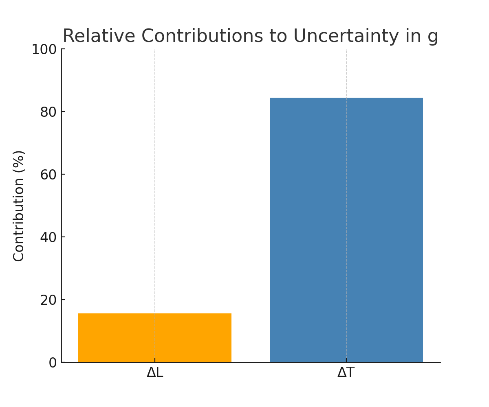

# Problem 1
# Measuring Earth's Gravitational Acceleration with a Pendulum
## Motivation

The acceleration due to gravity, \( g \), is a fundamental constant that affects all objects in free fall. Precise measurement of \( g \) is important in fields ranging from physics and engineering to geophysics and metrology.

One classical and accessible method to estimate \( g \) involves analyzing the oscillations of a simple pendulum. The period of a pendulum’s swing depends directly on the local gravitational acceleration and the length of the pendulum.

## Theoretical Background

For small angular displacements (typically less than 15°), the motion of a simple pendulum can be approximated as simple harmonic. The theoretical period \( T \) of one full oscillation is given by:

$$
T = 2\pi \sqrt{\frac{L}{g}}
$$

Where:
- \( T \) is the period of oscillation (in seconds),

- \( L \) is the length of the pendulum (in meters),

- \( g \) is the acceleration due to gravity (in m/s²).

Rearranging the equation allows solving for \( g \):

$$
g = \frac{4\pi^2 L}{T^2}
$$

To improve accuracy and reduce human error, the experiment measures the time for 10 oscillations and calculates the average. Uncertainties in both the length and the time measurements must be considered. The uncertainty in \( g \) is calculated using standard propagation of uncertainty:

$$
\Delta g = g \sqrt{\left(\frac{\Delta L}{L}\right)^2 + \left(2 \cdot \frac{\Delta T}{T}\right)^2}
$$

This relation accounts for the relative uncertainties in both \( L \) and \( T \).

## Experimental Setup

A simple pendulum was constructed using a string and a small weight suspended from a fixed point. The length \( L \) of the pendulum was measured from the suspension point to the center of mass of the weight using a ruler or measuring tape. The resolution of the measuring tool determines the uncertainty in length:

$$
\Delta L = \frac{\text{Ruler Resolution}}{2}
$$

The pendulum was displaced by a small angle (less than 15°) and released. The time for 10 full oscillations (\( T_{10} \)) was measured using a stopwatch or smartphone timer and repeated 10 times to account for variability in human reaction time.

> **Fig. :** Schematic of a simple pendulum. The length \( L \) is measured from the pivot to the center of mass of the bob. The angle \( \theta \) represents the initial small displacement from equilibrium.

Click to Expand Pendulum Schematic Code

<pre><code>
import matplotlib.pyplot as plt
import numpy as np

# Parameters
L = 1.0  # length of the pendulum
theta = np.radians(10)  # small displacement angle in radians

# Points
origin = np.array([0, 0])
bob = np.array([L * np.sin(theta), -L * np.cos(theta)])

# Arc for theta
arc_theta = np.linspace(0, theta, 100)
arc_x = 0.2 * np.sin(arc_theta)
arc_y = -0.2 * np.cos(arc_theta)

# Plot setup
plt.figure(figsize=(6, 6))
plt.plot([origin[0], bob[0]], [origin[1], bob[1]], color='black', linewidth=2, label="String (L)")
plt.plot(arc_x, arc_y, color='gray', linestyle='--')
plt.plot([0, 0], [0, -L], color='lightgray', linestyle=':')
plt.plot(bob[0], bob[1], 'o', color='blue', markersize=10)

# Labels
plt.text(bob[0] + 0.05, bob[1], "Bob", fontsize=10)
plt.text(-0.15, -L / 2, "L", fontsize=12)
plt.text(0.1, -0.05, r"$\theta$", fontsize=12)

# Formatting
plt.xlim(-1.2, 1.2)
plt.ylim(-1.2, 0.2)
plt.gca().set_aspect('equal')
plt.axis('off')
plt.title("Simple Pendulum Schematic")
plt.savefig("pendulum_schematic.png", bbox_inches='tight')
plt.close()
</code></pre>

---

## Raw Data and Measurement Summary

|      Trial   |       \( T_{10} \) (s)   |
|--------------|---------------------------|
|       1      |          20.15            |
|       2      |          20.21            |
|       3      |          20.09            |
|       4      |          20.12            |
|       5      |          20.18            |
|       6      |          20.10            |
|       7      |          20.14            |
|       8      |          20.19            |
|       9      |          20.16            |
|       10     |          20.11            |

> **Fig. :** Histogram of repeated timing measurements for 10 pendulum oscillations. The spread reflects timing variability and justifies the use of mean and uncertainty calculations.

Click to Expand Visual's Code

<pre><code>
import matplotlib.pyplot as plt

T10_measurements = [20.15, 20.21, 20.09, 20.12, 20.18,
                    20.10, 20.14, 20.19, 20.16, 20.11]

plt.figure(figsize=(8, 5))
plt.hist(T10_measurements, bins=7, color='skyblue', edgecolor='black')
plt.title("Distribution of Measured Times for 10 Oscillations")
plt.xlabel("Time for 10 Oscillations (s)")
plt.ylabel("Frequency")
plt.grid(True)
plt.savefig("t10_measurements_histogram.png")
plt.close()

</code></pre>

---

**Length of pendulum:**  
\( L = 1.000 \, \text{m} \)  
\( \Delta L = 0.005 \, \text{m} \)  *(ruler resolution: 1 cm)*

**Statistical summaries:**  
- \( \overline{T}_{10} = 20.145 \, \text{s} \) 

- \( \sigma_T = 0.037 \, \text{s} \)  

- \( \Delta T_{10} = \frac{0.037}{\sqrt{10}} = 0.012 \, \text{s} \) 

- \( T = \frac{20.145}{10} = 2.0145 \, \text{s} \)

## Results

- Estimated gravitational acceleration:  
  \( g = 9.73 \, \text{m/s}^2 \)

- Uncertainty in \( g \):  
  \( \Delta g = 0.12 \, \text{m/s}^2 \)

- Final result (with uncertainty):  
  \( g = (9.73 \pm 0.12) \, \text{m/s}^2 \)

Click to Expand Analysis Code

<pre><code>
import numpy as np

# Given values
L = 1.000       # length in meters
dL = 0.005      # uncertainty in length

T10_avg = 20.145   # average time for 10 oscillations
sigma_T = 0.037    # standard deviation of T10
n = 10

# Calculate mean time and uncertainty
T = T10_avg / 10
dT = sigma_T / np.sqrt(n)

# Calculate g
g = (4 * np.pi**2 * L) / T**2

# Propagate uncertainty
dg = g * np.sqrt((dL / L)**2 + (2 * dT / T)**2)

g, dg
</code></pre>

---

> **Fig. :** Relative contributions of \( \Delta L \) and \( \Delta T \) to the uncertainty in the calculated value of \( g \). The timing error is seen to dominate, consistent with the experimental procedure.

## Discussion of Uncertainty Sources

Several factors contribute to the uncertainty in the calculated value of \( g \):

- **Length Measurement (\( \Delta L \))**:  
  The ruler used had a resolution of 1 cm, resulting in an uncertainty of ±0.005 m. This contributes directly to the uncertainty in \( g \), though its effect is relatively small due to its appearance under a square root.

- **Timing Variability (\( \Delta T \))**:  
  Human reaction time when starting and stopping the stopwatch introduces variation across trials. This is the dominant source of uncertainty, as it appears squared in the error propagation formula.

- **Small Angle Assumption**:  
  The formula for \( T \) assumes a small angular displacement. Deviating beyond ~15° can introduce systematic error by violating the simple harmonic approximation.

- **Air Resistance and Friction**:  
  While typically small, air drag and pivot friction can slightly alter the period, affecting the accuracy of the result.

Overall, the estimated value of \( g = 9.73 \pm 0.12 \, \text{m/s}^2 \) is consistent with the standard value \( 9.81 \, \text{m/s}^2 \) within uncertainty bounds.

## Conclusion

The acceleration due to gravity was measured using a simple pendulum, yielding an estimate of  
\( g = (9.73 \pm 0.12) \, \text{m/s}^2 \).

The result is in good agreement with the standard value of \( 9.81 \, \text{m/s}^2 \), demonstrating the reliability of the pendulum method when proper measurement and uncertainty analysis are applied. The dominant source of uncertainty was timing variability, highlighting the importance of repeated trials and careful data handling in experimental physics.
